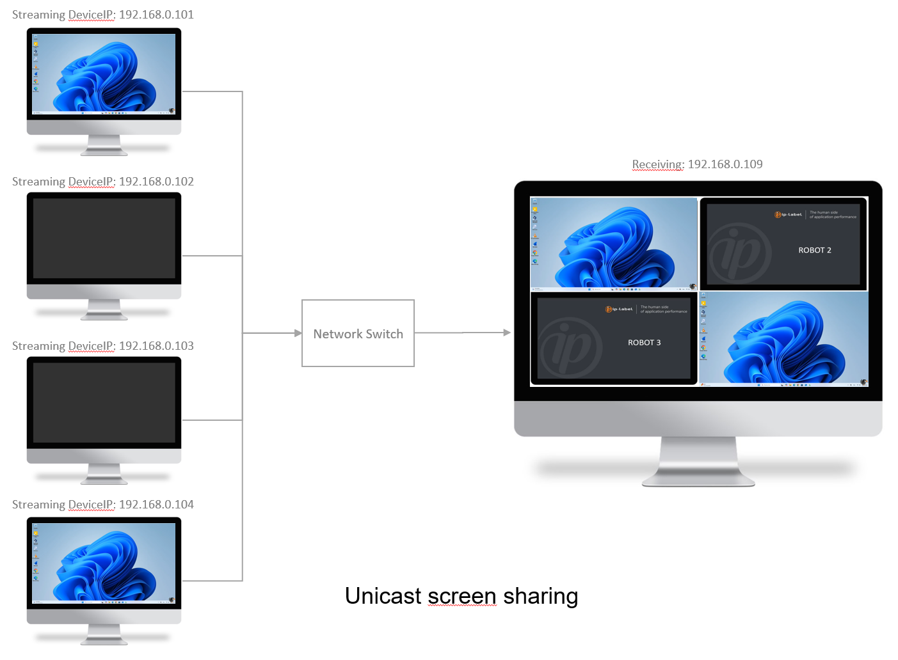

# Ekara-Mosaique_Robots

 

## Description
Streaming solution for broadcasting Ekara robot screens on a mosaic.

This solution uses VLC media player software (free and open source). [VLC](https://www.videolan.org/vlc/)

## Screens

## Architecture

## Requirements

-|version
--|:--:
VLC media player software|>=Any

## Download

[github-download]: https://github.com/MrGuyTwo/Ekara-Mosaique_Robots/tree/main/releases
 - [`Ekara-Mosaique_Robots`][github-download]

## Instalation

On Ekara robots :
- Download and install VLC VLC (https://www.videolan.org/vlc/)
- Drop the "VLC_ROBOT" folder to the local disk (Ex: C:\)
- In the "EKARA_ROBOT.vlm" file: 
    - On the "setup screen_robot output" line, configure the IP address of the PC on which the mosaic will be installed. In HTTP, if you do not provide the IP address, all PCs will be able to receive the video stream.
    - On the "setup screen_robot output" line, configure the desired communication port (8080 by default).
    - (By default, the stream will be sent over HTTP. You can also choose to use UDP.)

- In the "Run_VLC_Robot.cmd" file: 
    - Configure the path where "vlc.exe" is installed (VLC_PATH). 
    - Configure the path where the "VLC ROBOT" folder was dropped (VLC_ROBOT_CONF).

- Move the "Run_VLC_Robot.cmd" file to the "startup" folder of the user profile configured in the robot session startup. ((Win-key + R) shell:startup) 

On the PC hosting the mosaic :
- Download and install VLC VLC (https://www.videolan.org/vlc/)
- Drop the "VLC_MOSAIC" folder to the local disk (Ex: C:\)
- In the "EKARA_MOSAIC.vlm" file:
    - Configure / Add / Delete the blocks corresponding to the robots to be displayed in the mosaic (IP address / Port).
    - Configure / Add / Delete "control" lines for each robot.
    - On the "setup mosaic input" line configure the mosaic background (You have 5 different models) 

- In the "Run_VLC_Mosaic.cmd" file: 
    - Configure the path where "vlc.exe" is installed (VLC_PATH). 
    - Configure the path where the "VLC_MOSAIC" folder was dropped (VLC_MOSAIC_CONF).

- If you want the mosaic to start automatically, move the "Run_VLC_Mosaic.cmd" file to the “startup” folder of the user profile that starts the PC session. . ((Win-key + R) shell:startup)
