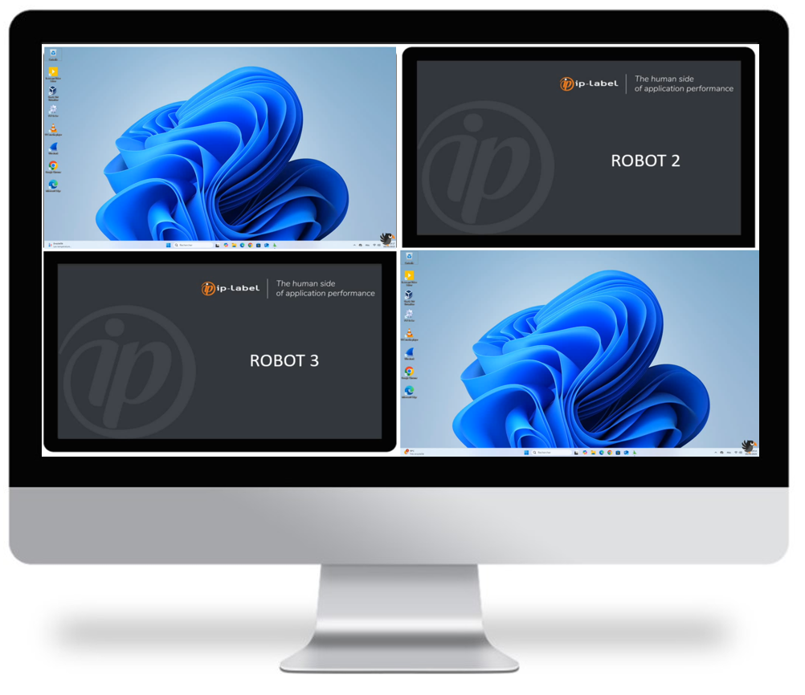

# Ekara-Mosaique_Robots

 

## Description
Streaming solution for broadcasting Ekara robot screens on a mosaic.

This solution uses VLC media player software (free and open source). [VLC](https://www.videolan.org/vlc/)

## Screens

## Architecture

## Requirements

-|version
--|:--:
VLC media player software|>=Any

## Download

[github-download]: https://github.com/MrGuyTwo/Ekara-Mosaique_Robots/tree/main/releases
 - [`Ekara-Mosaique_Robots`][github-download]

## Instalation

On Ekara robots :
- Install VLC (https://www.videolan.org/vlc/)
- Drop the "VLC_ROBOT" folder to the local disk (Ex: C:\)
- In the "EKARA_MOSAIC.vlm" file: 
    - Configure the IP address of Receiving device (mosaic).
    - Configure the communication port (8080 by default)

- In the "Run_VLC_Mosaic.cmd" file: 
    - Configure the path where "vlc.exe" is installed (VLC_PATH). 
    - Configure the path where the "VLC ROBOT" folder was dropped (VLC_CONF).

- Move the "Run_VLC_Mosaic.cmd" file to the "startup" folder of the user profile configured in the robot session startup. ((Win-key + R) shell:startup) 

On the PC hosting the mosaic :
- Install VLC (https://www.videolan.org/vlc/)
- Drop the "VLC_MOSAIC" folder to the local disk (Ex: C:\)
- In the "EKARA_MOSAIC.vlm" file:
    - Configure / Add / Delete the blocks corresponding to the robots to be displayed in the mosaic (IP address / Port).
    - Configure / Add / Delete "control" lines for each robot.

- In the "Run_VLC_Mosaic.cmd" file: 
    - Configure the path where "vlc.exe" is installed (VLC_PATH). 
    - Configure the path where the "VLC ROBOT" folder was dropped (VLC_CONF).

- Move the "Run_VLC_Mosaic.cmd" file to the “startup” folder of the user profile that starts the PC session. . ((Win-key + R) shell:startup)

